# **Sedeen Plugins for Cancer Diagnosis**

Here are the installation instructions and tutorial for the Sedeen plugins in the research project [Cancer Diagnosis](http://cancertech.cs.washington.edu/). 

<!-- TOC -->

- [**Sedeen Plugins for Cancer Diagnosis**](#sedeen-plugins-for-cancer-diagnosis)
    - [**Installation**](#installation)
        - [**Sedeen Viewer**](#sedeen-viewer)
        - [**Plugins and supporting files**](#plugins-and-supporting-files)
        - [**Install Anaconda**](#install-anaconda)
        - [**Install Dependencies**](#install-dependencies)
        - [**(Optional) Install CUDA for Nvidia GPU Only**](#optional-install-cuda-for-nvidia-gpu-only)
        - [**Supported Image Formats**](#supported-image-formats)
        - [**Create environment variable**](#create-environment-variable)
        - [**Install Sedeen Plugins**](#install-sedeen-plugins)
    - [**Tutorial**](#tutorial)
        - [**Open Sedeen Viewer**](#open-sedeen-viewer)
        - [**ROI Window Classifier**](#roi-window-classifier)
        - [**ROI Segmentation**](#roi-segmentation)
    - [**User Support**](#user-support)

<!-- /TOC -->

## **Installation**

The installation instructions are shown in Windows operation system. MacOS or Linux are not fully supported yet.

### **Sedeen Viewer**
To use the plugins, you need to download [Sedeen Viewer](https://pathcore.com/sedeen) first.

### **Plugins and supporting files**

Download our tools from [Github page](https://github.com/kechunl/cancer_diagnosis) by clicking on the "Clone or download" button first and then clicking on the "Download ZIP" button.

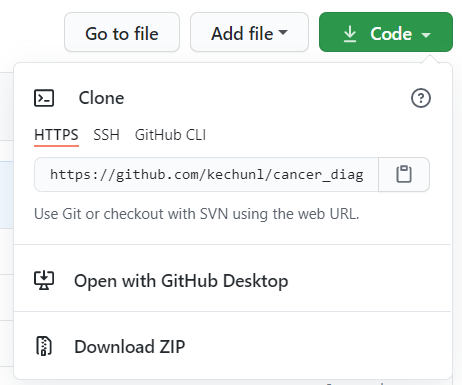

Note that the following steps are same as the installation instructions in the [research repo](https://github.com/cancertech/cancer_diagnosis). If you have already installed Anaconda and set up the conda environment, please skip to [Create environment variable](#create-environment-variable).

Unzip `cancer_diagnosis-master.zip`, you will see the following folders:

- YNet: source code for <a href="https://arxiv.org/abs/1806.01313" target="_blank">YNet</a> 
- data: contains a sample test image
- models: contains pre-trained models
- output: output files for all modules (contains pre-computed features for sample image)
- utils: other supporting source code

The unzipped folder can either be named as "cancer_diagnosis" or "cancer_diagnosis-master", which will not affect how the program runs.

### **Install Anaconda**

You need to install Python and dependencies required to run the provided package. We use Anaconda to manage Python dependencies, and you can download the latest version of Anaconda with Python 3.6 or 3.7 from 
<a href="https://www.anaconda.com/distribution/" target="_blank">here</a> .

You should follow the instructions as shown in the screenshots below. Pay attention to the buttons marked with red ink.
Installing Anaconda for all users to the "C:/ProgramData/Anaconda3/" path can make the program running smoothly.

<!--  	 -->


<br><br>

### **Install Dependencies**

After installing Anaconda, you can install all the required packages by double clicking on the `0_install_dependencies.bat` file, as shown below.

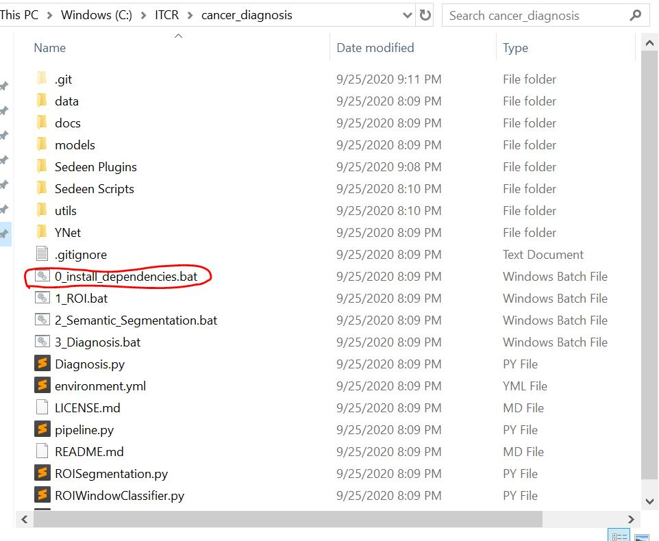

The installation may take around 10-20 minutes. After installation, you can proceed to tutorial.


If you see a "Windows protected your PC" window as below. You can first click on the "More Info" button and then "Run anyway" button to allow our program to run. 


When the installation is done, you can see a similar message as shown below.


<br><br>

### **(Optional) Install CUDA for Nvidia GPU Only**

In the semantic segmentation part, we will use Convolutional Neural Networks to analyze the input ROI images, and this slow process can be accelerated by using Nvidia GPUs.
If you have an Nvidia GPU in your computer, you can 
<a href="https://developer.nvidia.com/cuda-downloads" target="_blank">download</a>
and install CUDA 10.2 before running our programs.

### **Supported Image Formats**

We support PNG, JPG, TIFF, SVS, and many other image formats for MacOS and Linux. Unfortunately, we do not support SVS for Windows machine at the current stage, but you can easily convert your SVS files to JPG files by using
<a href="https://www.reaconverter.com/convert/svs_to_jpg.html" target="_blank">this converter</a>.

### **Create environment variable**

1. Right-click the **Computer** icon and choose **Properties**, or in Windows Control Panel, choose **System**.
2. Choose **Advanced system settings**.

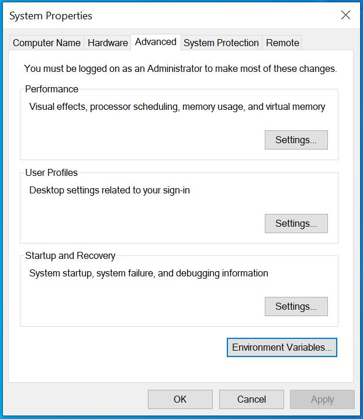

3. On the Advanced tab, click **Environment Variables**.

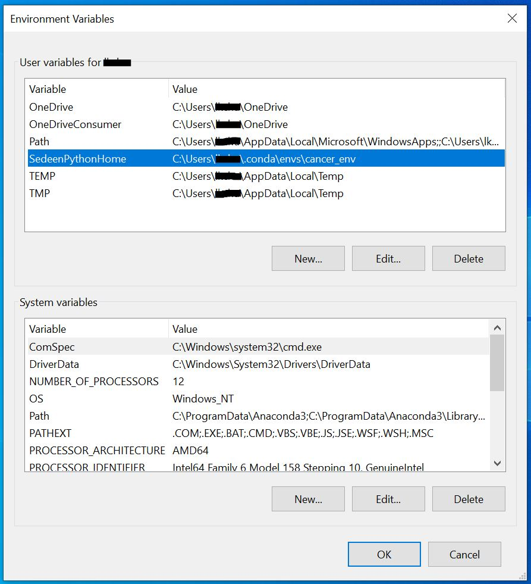

4. Click **New** under the **User variables** to create a new user variable.

```
Variable name: SedeenPythonHome
Variable value: "Full path of cancer_env"
```

Note that the path of **cancer_env** is usually *C:\Uses\%Username%\.conda\envs\cancer_env*. If you're not sure where the conda env is, you can launch the command lines by *Win+R*, open **cmd**, and run 

```
conda env list
```

The path listed beside **cancer_env** is the value you should put in user variable.

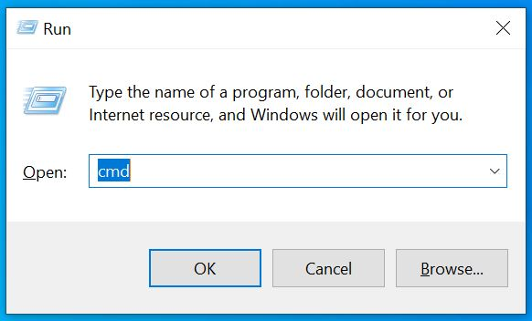
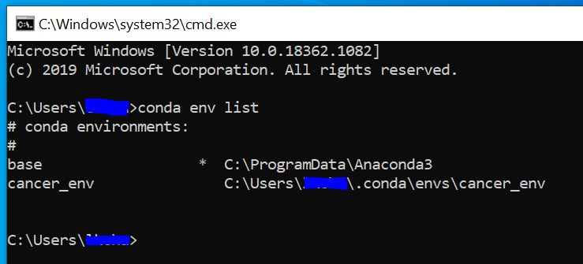

<br><br>
5. Apply this change and reboot your computer.

### **Install Sedeen Plugins**

Copy the folder [ITCR](../ITCR) to `%Sedeen Viewer%\pulgins\cpp`. `%Sedeen Viewer%` is where Sedeen is installed.

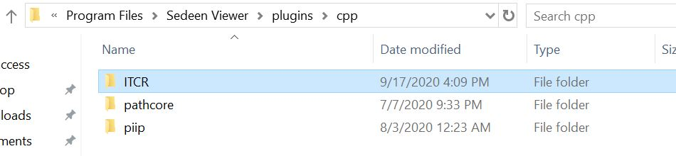
<br><br>

**Now You can start using our plugins.**

<br><br>
## **Tutorial**

### **Open Sedeen Viewer**
To use our plugins in `Sedeen Viewer`, you need to launch Sedeen in the conda environment `cancer_env`. **To make sure the plugins are running successfully, it's highly recommended that you launch a new `Sedeen Viewer` everytime you run a plugin.**

1. Launch command lines with *Win+R*, open **cmd**.


2. Change directory to where Sedeen Viewer is installed by

```
cd C:\Program Files\Sedeen Viewer
```

Note that the directory could change, depending on where you install it.

3. Switch to the environment by

```
conda activate cancer_env
```
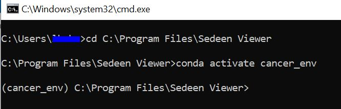

4. Open Sedeen Viewer with

```
sedeen.exe
```

### **ROI Window Classifier**

1. Open the image you want to process with File->Open.

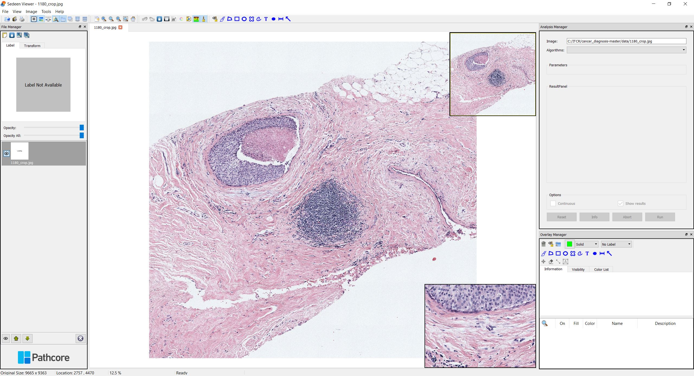

2. Select `ROI Window Classifier` from the algorithm option box in `Analysis Manager` window. If the window is not showing, you can go to View->Windows->Analysis Manager to get it displayed.

3. Choose an output path from the `Output Path` box.

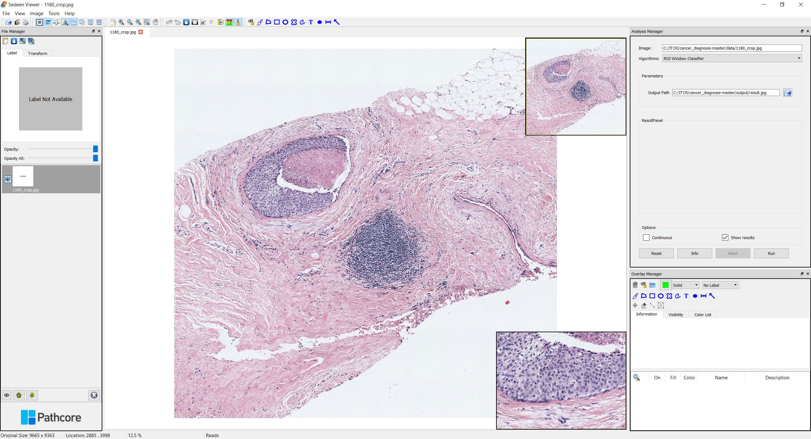

4. Click `Run` and select [Sedeen_ROIWindowClassifier.py](<../../Sedeen Scripts/Sedeen_ROIWindowClassifier.py>)

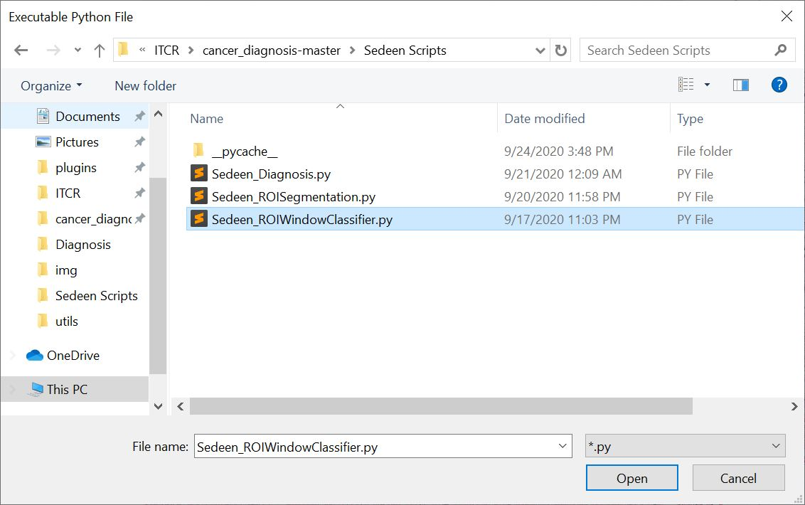

5. If it's the first time you run this image, it may take more than 10 minutes, depending on the memory and CPU capacity.


After running the program, Sedeen Viewer would display the ROI identification results where the regions-of-interest are marked in green boxes.

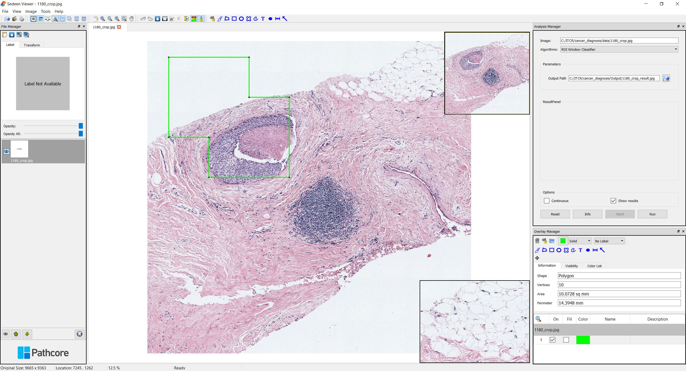

The following files will be generated in the selected folder, which can later be used for ROI segmentation and diagnosis prediction.

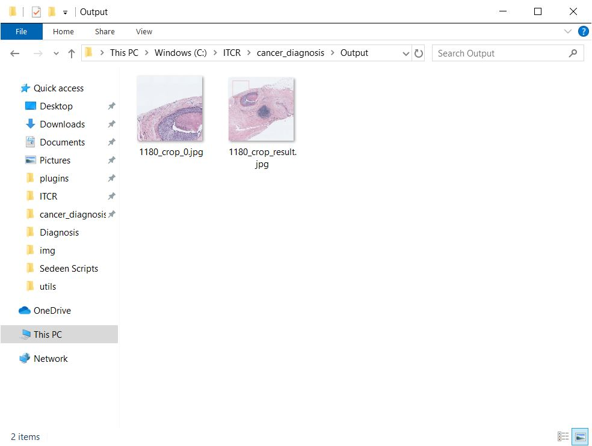

### **ROI Segmentation**


## **User Support**
If you have any questions, you can visit the [Github issue page]https://github.com/kechunl/cancer_diagnosis/issues) and submit an issue via the "New issue" button shown below.


